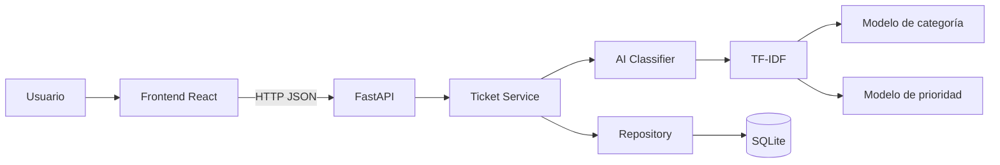

# Design – SmartDesk AI

## 1. Arquitectura
SmartDesk AI utiliza una arquitectura cliente-servidor modular.

## 2. Componentes
### Frontend React
Responsable de captura de solicitudes y presentación de resultados.

### FastAPI
Expone endpoints REST, valida datos y coordina el flujo de aplicación.

### Ticket Service
Contiene las reglas de negocio y orquesta persistencia y clasificación.

### AI Classifier
Implementa TF-IDF y regresión logística para categoría y prioridad. Devuelve una medida de confianza y una bandera de revisión manual.

### Repository
Aísla operaciones de persistencia.

### SQLite
Almacena solicitudes para el alcance académico.

## 3. Flujo principal
1. El usuario registra una solicitud.
2. El frontend envía JSON al backend.
3. FastAPI valida los datos.
4. Ticket Service envía el texto al clasificador.
5. Los dos modelos generan categoría y prioridad.
6. El sistema calcula confianza.
7. Se persiste la solicitud.
8. La API devuelve el resultado al frontend.

## 4. Decisiones técnicas
- **FastAPI:** API rápida, tipada y con documentación OpenAPI automática.
- **React:** interfaz moderna y separada del backend.
- **SQLite:** suficiente para demostración académica local.
- **scikit-learn:** permite un clasificador local reproducible sin depender de servicios externos.
- **pytest:** automatización de pruebas unitarias e integración.
