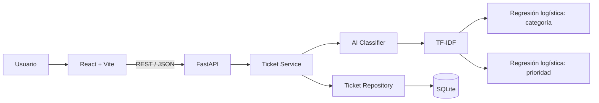

# Arquitectura – SmartDesk AI

## Responsabilidades
- **React + Vite:** experiencia de usuario.
- **FastAPI:** validación, API y documentación.
- **Ticket Service:** lógica de negocio.
- **AI Classifier:** predicción y confianza.
- **Repository:** acceso a datos.
- **SQLite:** persistencia académica.
